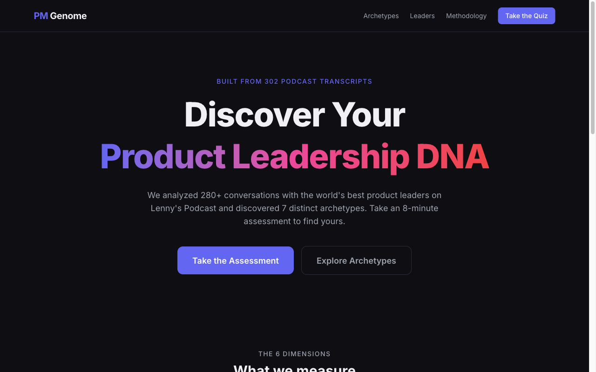
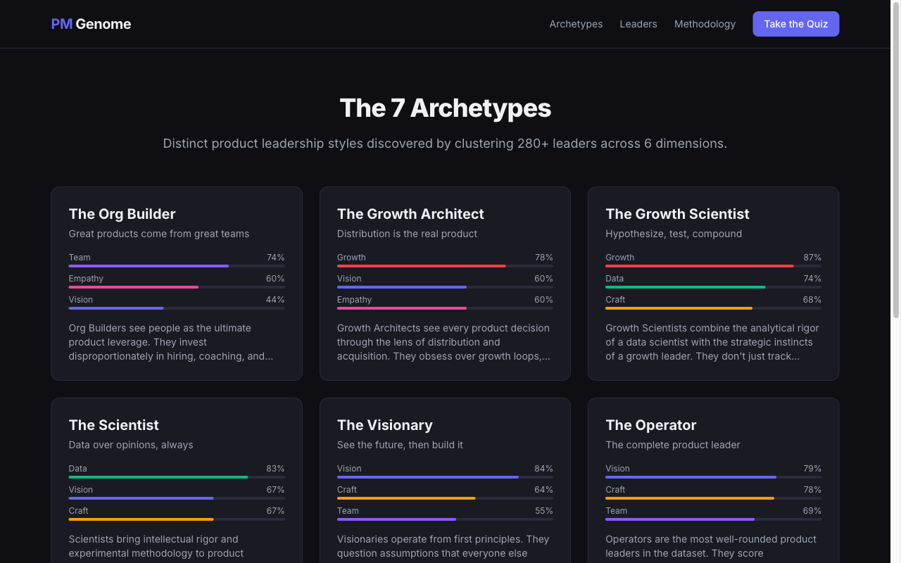
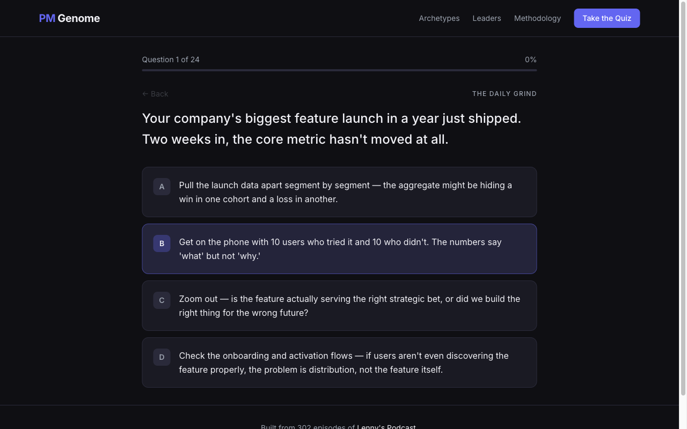
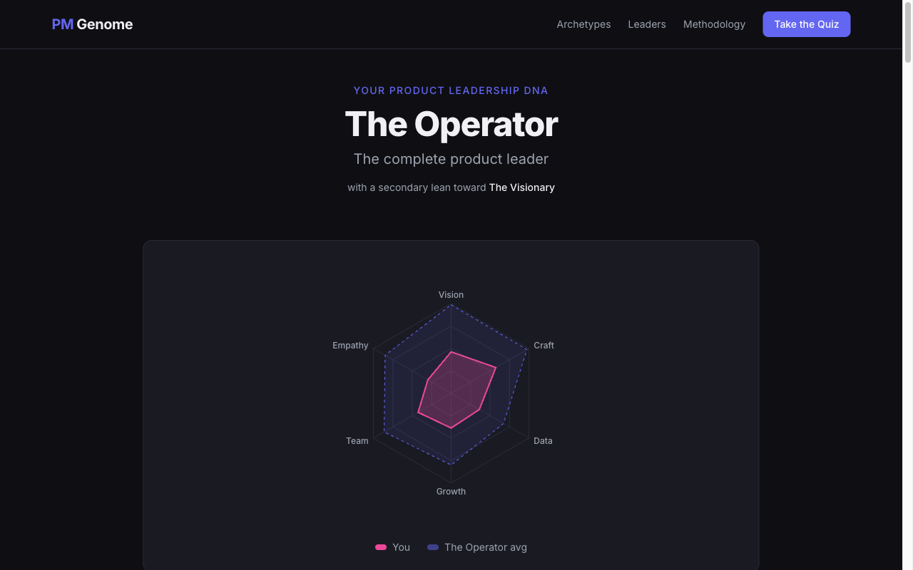
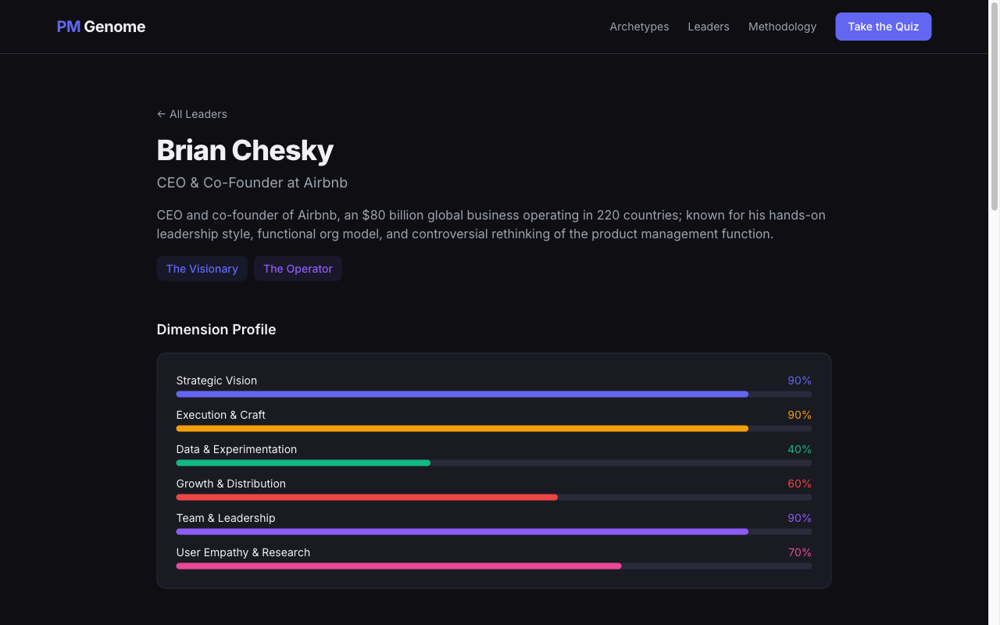

# I Analysed 302 Podcast Transcripts and Discovered 7 Types of Product Leader

## What happens when you point an AI at 186,000 lines of conversations with the world's best product people?

---

A few weeks ago, Lenny Rachitsky released the full transcripts of 302 episodes of his podcast — arguably the most comprehensive archive of product leadership thinking that exists. Over 280 guests, from Brian Chesky to Shreyas Doshi to Elena Verna, each sharing how they actually think about building products.

The community responded with the obvious things: RAG chatbots, search tools, summary generators. All perfectly useful. But I found myself wondering something different: **what if you could map the landscape of product leadership itself?**

Not "what did guest X say about metrics?" but rather: across all these conversations, what distinct *types* of product leader emerge? And could you build something that lets any PM discover which type they are?

That's what I built. It's called [The PM Genome Project](https://pm-genome.pages.dev/), and it's live now. Here's how it works, and what I found.

---

## The Idea: Product Leadership Has a Shape

If you listen to enough of these episodes, patterns start to emerge. Some leaders talk almost exclusively about vision and strategy. Others obsess over execution quality and craft. Some are deeply data-driven; others are all about growth mechanics; others about team building and organisational design.

It struck me that these aren't random — they're dimensions. Every product leader has a profile across these dimensions, and those profiles cluster into recognisable archetypes.

So I set out to extract, score, and cluster every leader in the dataset along six dimensions:

- **Strategic Vision** — direction-setting, first principles, long-term bets
- **Execution & Craft** — shipping velocity, quality obsession, design excellence
- **Data & Experimentation** — measurement rigour, A/B testing, evidence-based decisions
- **Growth & Distribution** — growth loops, PLG, viral mechanics, acquisition strategy
- **Team & Leadership** — hiring, culture, coaching, org design
- **User Empathy & Research** — customer obsession, design thinking, JTBD

*The PM Genome Project landing page*

---

## How It Was Built

I'll be honest — this would have been a painful project without [Claude Code](https://docs.anthropic.com/en/docs/claude-code). The entire thing was built in a few intensive sessions with Claude as a pair programmer, handling everything from transcript parsing to data extraction to the frontend.

### The Data Pipeline

The first challenge was the transcripts themselves. 302 text files, each with slightly different formatting — some use `HH:MM:SS` timestamps, some use `MM:SS`, some guests go by first name only (is "Melissa" Melissa Perri or Melissa Tan?), one file has no blank lines between speakers, and several episodes feature multiple guests. There are also compilation episodes that needed to be excluded.

A normalisation script handles all of these edge cases, producing clean, structured JSON for each transcript.

Then came the extraction. Three Claude agents read every single transcript and scored each leader across the six dimensions, pulling out key themes, leadership principles, notable quotes, and biographical context. This wasn't a quick API call per transcript — it required actually reading and understanding each conversation. The result: 284 unique leader profiles, each with a six-dimensional score vector.

### The Clustering

With 284 leaders plotted in six-dimensional space, I ran k-means clustering to see what natural groupings emerged. The answer: seven distinct archetypes.

*The seven product leadership archetypes that emerged from the data*

The archetypes aren't prescriptive — they're descriptive. They reflect genuine patterns in how the world's best product people think and operate:

1. **The Visionary** — "See the future, then build it" (Chesky, Lutke, Andreessen)
2. **The Craftsperson** — "Obsessed with how it's built" (Shreyas Doshi, Julie Zhuo)
3. **The Scientist** — "Let the data decide" (Ronny Kohavi, Sean Ellis)
4. **The Growth Architect** — "Engineer the growth machine" (Elena Verna, Casey Winters)
5. **The Growth Scientist** — "Experiment, measure, scale"
6. **The Org Builder** — "Build the team that builds the product" (Marty Cagan, Claire Hughes Johnson)
7. **The Operator** — "The complete product leader" (balanced across all dimensions)

What I found genuinely interesting is that these archetypes aren't better or worse — they're different. A Visionary isn't superior to a Craftsperson; they're solving different problems with different strengths. And every archetype has blind spots.

---

## The Quiz

The centrepiece is a 24-question scenario-based assessment. You're presented with realistic product situations — the kind you actually face at work — and asked how you'd respond.

*Each question presents a realistic scenario with four smart responses — there are no wrong answers*

The questions are deliberately designed so that every option is a perfectly reasonable response. There are no trick answers or obvious "correct" choices. The differences are in what you *prioritise* — and those priorities reveal your product leadership DNA.

The quiz is organised in three tiers: Daily Grind (everyday decisions), Hard Tradeoffs (the messy middle), and Defining Moments (the big calls). Each tier gets progressively more challenging, asking you to make tougher tradeoffs between competing good options.

It takes about eight minutes. At the end, your answers are scored across the six dimensions and matched against the archetype centroids using cosine similarity.

---

## What You Get

Your results page shows your primary archetype, a radar chart of your six dimension scores, and quite a bit more.

*Your results: primary archetype, dimension scores, and how you compare to the archetype centroid*

**Matched Leaders**: The five product leaders whose profiles most closely match yours, based on cosine similarity between your score vector and theirs. Each comes with their bio, a notable quote, and a link to their full profile.

**Blind Spots**: Your two weakest dimensions, with specific guidance on what to watch out for and which leaders to learn from to shore up those areas.

**Learning Path**: Curated episodes from the podcast — both to double down on your strengths and to address your blind spots. Each recommendation includes why that episode is relevant and what you'll take away from it.

**Shareable Results**: A generated card you can share on social media, plus a URL that encodes your quiz answers in about 16 characters so anyone can see your results.

---

## The Leader Profiles

One of the quieter features I'm quite pleased with: 284 individual leader profile pages, each generated from the transcript analysis.

*Each leader gets a profile showing their dimension scores, archetype, key themes, and notable quotes*

Every profile shows the leader's dimension scores, their archetype assignment, key themes from their episode, and their most notable quotes. It's a genuinely useful way to explore the dataset beyond just taking the quiz.

---

## The Technical Bits (for Those Interested)

The whole thing is a static site — no backend, no database, no server costs. The stack:

- **Astro 5** for static site generation (~80% of pages are zero-JavaScript HTML)
- **React islands** for the interactive bits (quiz, results, leader search)
- **Tailwind CSS 4** for styling
- **Recharts** for the radar charts
- **Cloudflare Pages** for hosting (free tier, unlimited bandwidth)

Quiz scoring happens entirely in the browser — it's just maths against pre-computed JSON. Results are shareable via URL-encoded quiz answers. The total monthly hosting cost is zero.

The data pipeline scripts, the extraction process, the clustering, the quiz design, the frontend, the deployment — all built with Claude Code as my AI pair programmer. I'm a reasonably experienced developer, but the breadth of this project (NLP extraction, statistical clustering, data visualisation, interactive quiz design, static site generation) would have taken weeks without it. Claude Code handled the transcript parsing edge cases, wrote the clustering algorithm, built the React components, and even generated the OG images.

---

## What I Learned

A few things surprised me:

**The archetypes are real.** I was half-expecting the clustering to produce arbitrary groupings. Instead, when I looked at which leaders fell into each cluster, they made immediate intuitive sense. The Visionaries really are the big-picture thinkers. The Craftspeople really do obsess over execution quality. The clustering found genuine structure in the data.

**Balance is rare.** Very few leaders score evenly across all six dimensions. Most have one or two dominant dimensions and corresponding blind spots. The Operator archetype — leaders who are genuinely balanced — is the smallest cluster, which tracks with the common wisdom that truly well-rounded product leaders are uncommon.

**Growth is its own thing.** I initially expected growth-focused leaders to cluster with data-driven leaders (since growth work is inherently experimental). Instead, growth emerged as two distinct archetypes: the Growth Architect (strategy-focused, systems-thinking about growth loops) and the Growth Scientist (experiment-focused, metrics-driven optimisation). The distinction between designing growth systems and running growth experiments turned out to be quite real.

---

## Try It

The assessment is free, takes about eight minutes, and doesn't require sign-up or any personal information. Your answers stay in your browser.

**[Take the PM Genome Assessment](https://pm-genome.pages.dev/quiz)**

I'd genuinely love to hear what archetype you get and whether it rings true. The best feedback is "that's weirdly accurate" or "that's completely wrong" — both are useful.

The code is open source: [github.com/tonygillett136/pm-genome](https://github.com/tonygillett136/pm-genome)

---

*Built with Claude Code. Data sourced from Lenny's Podcast transcripts, released publicly by Lenny Rachitsky.*
